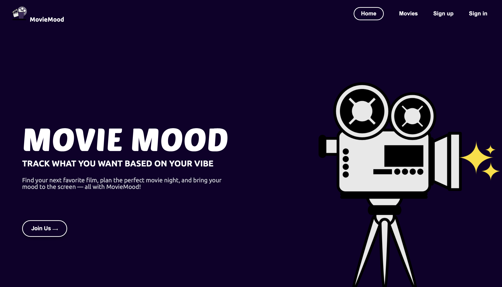
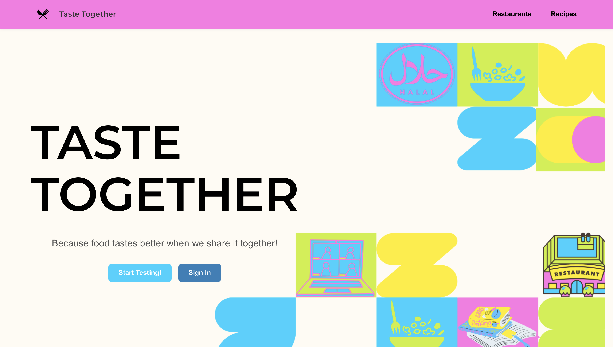
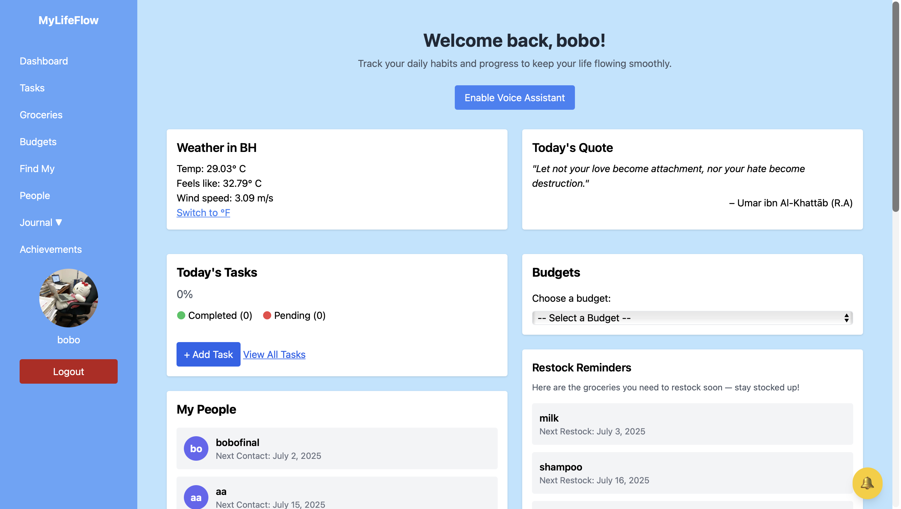
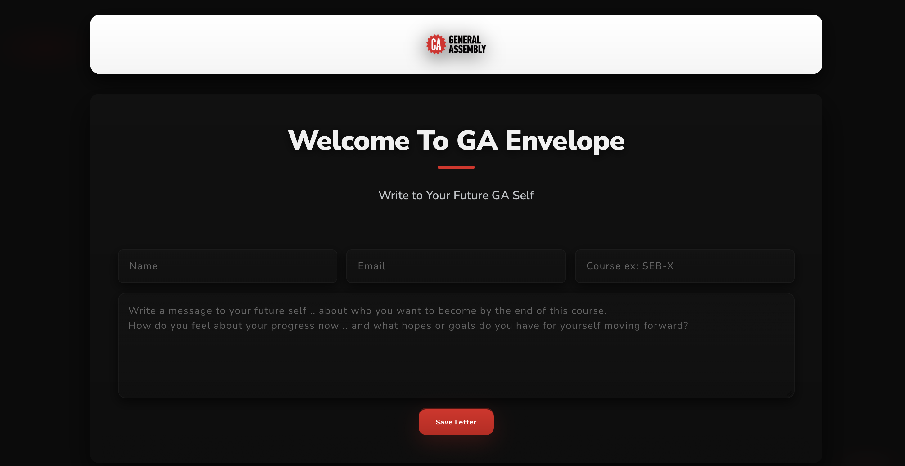
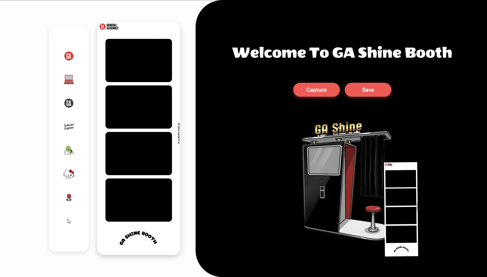
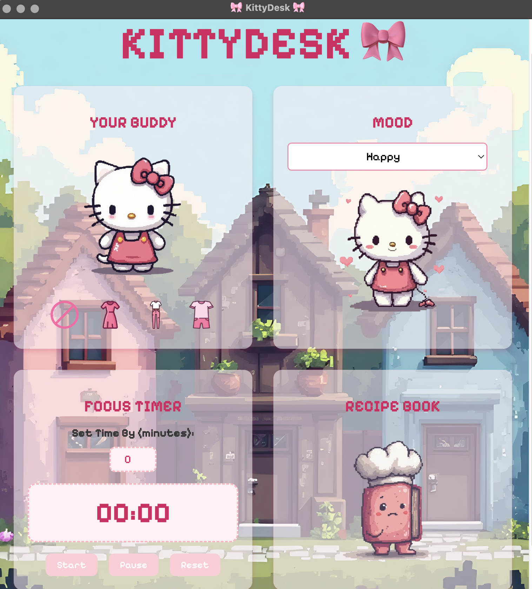

# 🌸 Bidoor Almannaei – Software Engineer & Full-Stack Developer

Welcome to my personal portfolio!  
I’m **Bidoor Almannaei**, a **Software Engineer & Full-Stack Developer**, currently working as an  
**Associate Instructor for Software Engineering at General Assembly**, helping students learn and grow while building creative applications.

---

## About Me

Hi! I'm **Bidoor Almannaei**, passionate about coding, teaching, and building creative full-stack web applications.  
I enjoy blending design, storytelling, and functionality to make every project meaningful and visually engaging.

---

## GA Projects

### [GA-Movie Mood](https://github.com/shsasa/moviemood)
A web app that helps track movies to watch and create custom lists.  
**Tech Stack:** Node.js, Express.js, MongoDB (Mongoose), EJS  

---

### [GA-TasteTogether](https://github.com/ManarSwar97/TasteTogether-Backend)
A web app for food lovers to share recipes, discover dishes, and connect with friends.  
**Tech Stack:** Node.js, Express.js, Authentication & Session Middleware, MongoDB (Mongoose), React  

---

### [GA-MyLifeFlow](https://github.com/ManarSwar97/MyLifeFlow/tree/main)
A personal dashboard app for tasks, budgeting, grocery restocks, QR-based inventory, voice journaling, and yearly achievements tracking.  
**Tech Stack:** Python, Django, JS, Pillow, HTML & CSS  

---

## GA Instructor Projects

### [GA-Envelope](https://github.com/Bodoorr/GA-Envelope) · [Try the App](https://ga-envelope.up.railway.app)
Students can write a letter to their future selves.  
**Tech Stack:** Node.js, Express.js, MongoDB (Mongoose), JS, EJS, CSS  

---

### [GA-Shine Booth](https://github.com/Bodoorr/GA-Envelope) · [Try the App](https://ga-shine-booth.up.railway.app)
Capture photos with live video, add fun stickers, and upload them to the cloud.  
**Tech Stack:** Node.js, Express.js, JS, Multer, Cloudinary, HTML & CSS  

---

## Personal Projects

### 🎀 [KittyDesk](https://github.com/Bodoorr/KittyDesk) · [Try the App](https://kittydesk.onrender.com)
A desktop & web app inspired by Hello Kitty where users can customize mood, outfits, timer, and recipes.  
**Tech Stack:** Electron.js, Express.js, Node.js, Multer, MongoDB (Mongoose), HTML & CSS  

---

## Contact

📧 **Bodoor3358@gmail.com**  
© 2025 Bidoor Almannaei

---

> _“Code with creativity, teach with passion, and design with heart.”_
